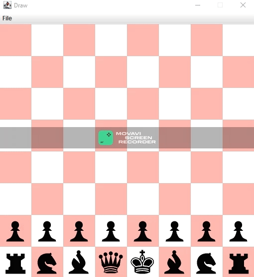

# Xadrez Java ♟️

### Captura de Tela 📸



### Implementações

- ✔️
    - Desenhar fundo xadrez
    - Desenhar as peças
    - Regra de movimento de cada peça
    - Mostrar peça selecionada e desselecionar 
    - Verificar se há peças no caminho
    - Não sobrepor peças
    - Mensagem de movimento inválido no terminal

  
### UML 📄

````mermaid

classDiagram
    
    direction TB
    
    App "1"*-->"1" Tabuleiro
    Tabuleiro "1"*-->"0..16" Peca
    
    Peca <| --"0..8" Peao
    Peca <| --"0..2" Torre
    Peca <| --"0..2" Bispo
    Peca <| --"0..2" Cavalo
    Peca <| --"0..1" Rei
    Peca <| --"0..1" Rainha


    class App{
        - dimensao : int
        - tabuleiro : Tabuleiro
        - draw : Draw

        +desenharTela() void
        +desenharTabuleiro() void
        +desenharPecas() void
        +mousePressed(x : double, y : double) void

    }

    class Tabuleiro{
        - pecas : ArrayList~Peca~

        + verificarCaminho(pAtual : Peca, xClique double, yCLique : double) boolean
        + desenharPecasNoTabuleiro(draw : Draw) boolean
        + desenharSombraPecaSelecionada(draw : Draw) boolean
        + verificarSeJaTemPeca(xClique : double, yClique : double) boolean
    }
    
    class Peca{
        <<abstract>>
        #xAtual : double
        #yAtual : double
        #selecionada : boolean
        
        +movimentoCadaPeca(xClique : double, yClique : double) boolean*
        +desenharPeca(draw : Draw) boolean*
        +marcaDesmarca() boolean

    }
    
    class Peao{
        -primeiroMovimento : boolean
    }

    class Torre{
        
    }
    
    class Cavalo{
        
    }
    
    class Bispo{
        
    }
    
    class Rei{
        
    }
    
    class Rainha{
        
    }
    

````